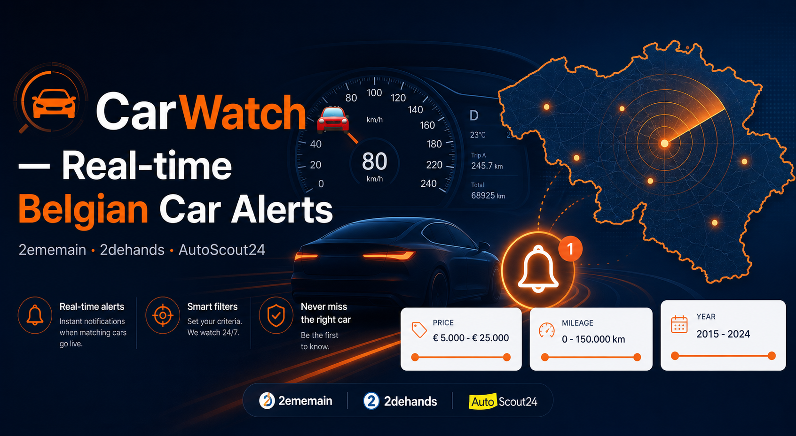

<div align="center">



# CarWatch 🚗

### Real-time Belgian used car alert system

[](https://python.org)
[](https://fastapi.tiangolo.com)
[](https://core.telegram.org/bots)
[](LICENSE)

`#car-alerts` `#belgium` `#telegram-bot` `#web-scraping` `#fastapi`
`#2ememain` `#autoscout24` `#2dehands` `#deal-finder`

</div>

---

Scrapes **2ememain.be**, **2dehands.be** and **AutoScout24.be** in parallel, scores deals mathematically (0–100), and pushes **instant Telegram notifications** the moment a matching listing goes online.

---

## Features

| Capability | Detail |
|---|---|
| **Multi-source scraping** | 2ememain, 2dehands & AutoScout24 — parallel, with retry logic |
| **Deal scoring** | Each car scored 0–100 based on price, mileage, year |
| **Telegram alerts** | Instant push notifications for new matching listings |
| **Radius search** | Search within X km of any Belgian city |
| **Filters** | Make, budget, mileage, year, fuel type, gearbox, region |
| **Web dashboard** | Clean UI to browse and sort results |
| **One-click deploy** | Railway-ready with `Procfile` + PostgreSQL |

---

## Stack

| Layer | Technology |
|---|---|
| Backend | FastAPI + SQLAlchemy (SQLite / PostgreSQL) |
| Frontend | React 18 (CDN, no build step) + Tailwind CSS |
| Bot | `python-telegram-bot` with job queue scheduler |
| Scraping | `requests` + BeautifulSoup4 + Adevinta JSON API |
| Deal scoring | Custom mathematical model (price/mileage/year) |

---

## Quick start

```bash
git clone https://github.com/ForgedEmir/CarWatch.git
cd CarWatch

python -m venv venv && source venv/bin/activate
pip install -r requirements.txt

cp .env.example .env
# Edit .env with your TELEGRAM_TOKEN and ALLOWED_USER_ID
```

**Get your Telegram credentials:**
- `TELEGRAM_TOKEN` → [@BotFather](https://t.me/BotFather), send `/newbot`
- `ALLOWED_USER_ID` → [@userinfobot](https://t.me/userinfobot)

### Run

```bash
# Terminal 1 — web interface
uvicorn app:app --reload

# Terminal 2 — Telegram bot + scheduler
python bot.py
```

Open **http://localhost:8000**

---

## Deploy on Railway

1. Push to GitHub → go to [railway.app](https://railway.app)
2. **New Project** → **Deploy from GitHub repo**
3. Add **PostgreSQL** plugin (Railway sets `DATABASE_URL` automatically)
4. Set env vars: `TELEGRAM_TOKEN`, `ALLOWED_USER_ID`
5. Railway reads the `Procfile` and starts web server + bot

---

## Telegram commands

| Command | Description |
|---|---|
| `/start` | Start the bot and activate alerts |
| `/status` | Show current search configuration |
| `/marque BMW` | Set car make |
| `/prix 2000 8000` | Set price range (€) |
| `/km 150000` | Set max mileage |
| `/annee 2015` | Set minimum year |
| `/region Liège` | Set search region |
| `/carburant diesel` | Set fuel type |
| `/boite automatique` | Set gearbox type |
| `/intervalle 1` | Check every N hours (default: 2) |
| `/search` | Trigger an immediate search |

---

## Project structure

```
├── app.py              FastAPI server + web UI
├── bot.py              Telegram bot + alert scheduler
├── scraper.py          Parallel scraper (3 sources)
├── ai_analyzer.py      Mathematical deal scoring (0–100)
├── worker.py           Background thread + database save
├── database.py         SQLAlchemy setup
├── models.py           Listing model
├── media_service.py    Async image download + WebP optimization
├── data_pipeline.py    Data normalization helpers
├── static/             React frontend (CDN, no build)
├── Procfile            Railway process config
└── requirements.txt    Python dependencies
```

---

## Contributing

| Resource | Description |
|---|---|
| [CONTRIBUTING.md](CONTRIBUTING.md) | Setup, workflow, PR process |
| [CODE_OF_CONDUCT.md](CODE_OF_CONDUCT.md) | Community standards |
| [SECURITY.md](SECURITY.md) | Vulnerability reporting |
| [LICENSE](LICENSE) | MIT — free to use, modify, distribute |

---

<div align="center">

**CarWatch** — Never miss the right car again.

</div>
